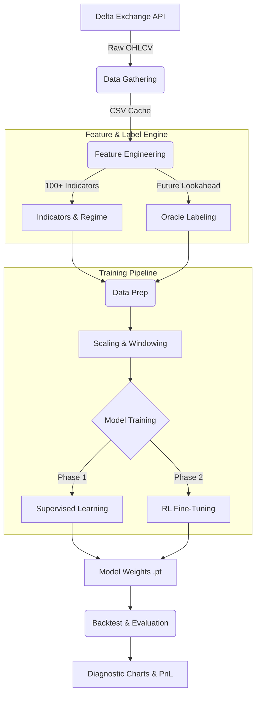

# 🚀 Stock LLM: Global AI Trading System

A professional-grade transformer-based trading engine designed for multi-symbol scalping (15m timeframe). This system uses a dual-head Transformer architecture to predict market direction and optimal position sizing.

## 📊 System Architecture & Data Flow

Below is the step-by-step lifecycle of how data moves from the exchange to the model and finally to a trade signal.

---

## 🛠 Stage-by-Stage Breakdown

### Stage 1: Data Gathering (`data_gathering.py`)
- **Action**: Fetches historical candles from the Delta Exchange API.
- **Goal**: To build a robust 1-year historical dataset for symbols like BTC and ETH.
- **Output**: Cleaned OHLCV CSV files in the `data/` directory.

### Stage 2: Feature Engineering (`features.py`)
- **Action**: Transforms raw price into mathematical signals.
- **Logic**: 
    - **Trend**: EMAs, SMAs, Supertrend (Directional bias).
    - **Momentum**: RSI, MACD, Stochastics (Overbought/Oversold).
    - **Regime**: Chop Index, ADX (Market environment).
    - **Acceleration**: Delta-of-Delta returns (Momentum inflection points).
- **Result**: A high-dimensional feature matrix where each row describes the market "state."

### Stage 3: Oracle Labeling Engine (`features.py`)
- **Action**: The system looks **into the future** (e.g., 12 bars ahead) for each historical row.
- **Decision**: 
    - If price hits a 0.70% target before a 0.40% stop → Label = **BUY**.
    - If price hits a -0.70% target before a +0.40% stop → Label = **SELL**.
    - Otherwise → Label = **NEUTRAL**.
- **Use**: This provides the model with "perfect" training data based on actual trade outcomes.

### Stage 4: Data Preparation (`training_utils.py`)
- **Scaling**: Uses `StandardScaler` to ensure all features (like RSI 0-100 and Volatility 0.01) are on a comparable scale for the Transformer.
- **Windowing (Sequences)**: Slices data into windows of 48 bars. The model sees the **context** of the last 12 hours before making a prediction for the next bar.

### Stage 5: Dual-Head Transformer Model (`models.py`)
- **Architecture**: A Causal Transformer Encoder (Attention-based).
- **Head 1 (Signal)**: Classifies the window into [LONG, NEUTRAL, SHORT].
- **Head 2 (Sizing)**: Predicts the optimal Quantity Ratio, Take-Profit%, and Stop-Loss% based on current volatility.

### Stage 6: Training Pipeline (`training_utils.py`)
- **Phase 1 (Supervised)**: Uses **Focal Loss** to force the model to learn rare, high-quality trade setups instead of just guessing "Neutral" most of the time.
- **Phase 2 (Reinforcement Learning)**: Fine-tunes the model by penalizing it based on **PnL Consequences**. If a high-confidence signal results in a loss, the model is heavily punished.

### Stage 7: Evaluation & Diagnostics (`main.py` + `diagnostics.py`)
- **Action**: Runs the trained model on "unseen" test data (the most recent 30 days).
- **Output**: 
    - **Equity Curve**: Visualizes capital growth.
    - **Confusion Matrix**: Shows where the model is getting confused (e.g., calling a Sell a Buy).
    - **Feature Relevance**: Identifies which indicators are actually helping the model.

---

## 🚀 Running the System

1. **Configure**: Edit `config.py` to set symbols, timeframes, and risk limits.
2. **Train**: Run `python main.py`.
3. **Analyze**: Check the `backtest_results/diagnostics/` folder for performance charts.
